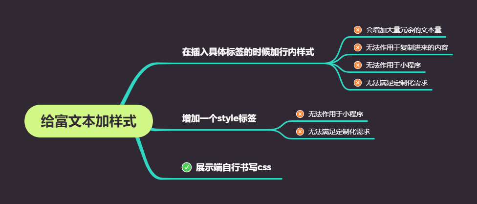
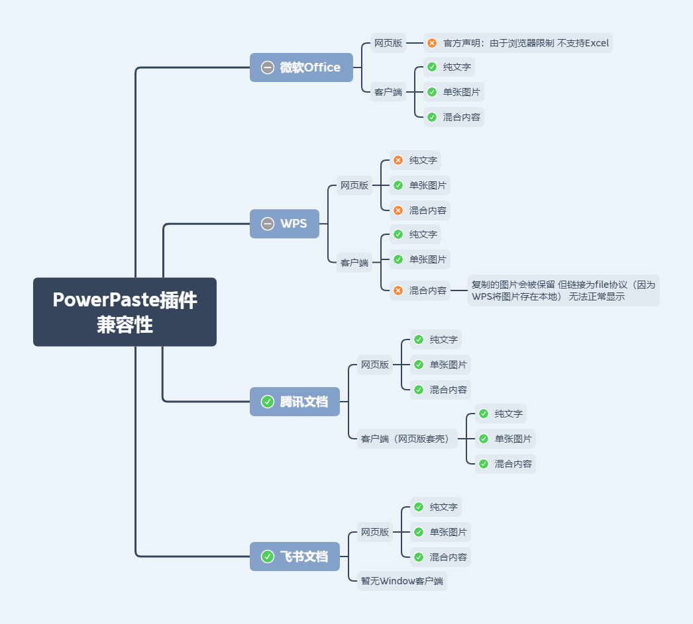

# minimce

可离线使用、支持 Word 文档插入的富文本编辑器，基于 [tinymce](https://github.com/tinymce/tinymce) 。

<br>

## 特性

- 灵活可配
- 可离线使用
- 支持插入 Word 文档（.docx），兼容 Microsoft Office、WPS
- 支持自定义菜单项
- 默认启用 [TinyMCE Plan](https://www.tiny.cloud/pricing) 对应的全套插件（mediaembed 除外，需搭配后端服务）
- 为 essential 以上的 plan 提供换肤、换图标风格工具栏选项
- 适配 [element-ui](https://github.com/ElemeFE/element) （只读状态默认跟随 el-form）
- 全局或局部引入，参数支持全局或局部配置

<br>

## 安装


```bash
npm add minimce tinymce vue@2 element-ui
```

```ts
// 全局引入

import Minimce from 'minimce'

Vue.use(Minimce, {
  // 全局配置
})
```

```vue
<!-- 局部引入 -->

<template>
  <Minimce v-bind="config"/>
</template>

<script>
import Minimce from 'minimce'

export default {
  components: { Minimce },
  data () {
    return {
      config: {
        // 局部配置
      }
    }
  }
}
</script>
```

<br>

## 参数

| Attribute | Description | Type | Accepted Values | Default |
| --- | --- | --- | --- | --- |
| value / v-model | html格式的输入内容 | string | | |
| apiKey | tinymce api key | string | https://www.tiny.cloud/auth/signup/ | |
| plan | tinymce plan（默认启用plan包含的全套插件，mediaembed除外） | string | 'core'/'essential'/'professional'/'custom' 参考https://www.tiny.cloud/pricing | 'core' |
| disabled | 是否禁用（禁用模式不可编辑，保留工具栏） | boolean | | false |
| readonly | 是否只读（只读模式仅展示html，相当于预览） | boolean | | false |
| tinymceOptions | tinymce配置 | object | https://www.tiny.cloud/docs/configure/ | 除setup之外均可配置 |
| eventBus | 事件总线 | Vue instance | | |
| Imgpond（即将废弃） | 上传图片插件（配置后自动开启功能） | Vue component | | |
| Filepool（即将废弃） | 上传文件插件（配置后自动开启功能） | Vue component | | |
| MobileLink（即将废弃） | 插入移动端页面链接插件（配置后自动开启功能） | Vue component | | |

<br>

**Imgpond（即将废弃）**

> You can use Imgpond to upload local images.

```js
import Imgpond from 'imgpond'
Vue.use(Imgpond)

import Minimce from 'minimce'
Vue.use(Minimce, {
  Imgpond
})
```

**Filepool（即将废弃）**

> You can use Filepool to upload local audio and video.

```js
import Filepool from 'filepool'
Vue.use(Filepool)

import Minimce from 'minimce'
Vue.use(Minimce, {
  Filepool
})
```

**MobileLink（即将废弃）**

> tinymce的插入链接功能只能插入普通链接 如果需要定制化需求 比如想要插入的链接是移动端某个页面的链接 可以自定义一个组件

组件通过 `eventBus.$emit('insertTag', '<div/>')` 插入标签

```js
// 事件通信
const eventBus = new Vue()
export { eventBus } // 用于其它组件与Minimce通信

import MobileLink from '@/components/MobileLink'
import Minimce from 'minimce'

Vue.use(Minimce, {
  MobileLink,
  eventBus
})
```

<br>

## 参数配置规则

- 双向绑定参数（`v-model`, `*.sync`）仅支持局部配置
- 其余参数均支持全局或局部配置

权重：

- 局部配置高于全局配置
- 对于对象类型的参数 局部配置会与全局配置进行合并 同名属性会被局部配置覆盖

<br>

## 添加自定义菜单项

### 插入图片

[示例代码](https://github.com/cloydlau/minimce/tree/master/demo/ImageInsertion)

### 插入音视频

[示例代码](https://github.com/cloydlau/minimce/tree/master/demo/FileInsertion)

### 插入小程序页面链接

[示例代码](https://github.com/cloydlau/minimce/tree/master/demo/MobileLink)

### 菜单图标

如果 [官方图标库](https://www.tiny.cloud/docs/advanced/editor-icon-identifiers/) 里没有，可以自行 [添加图标](https://www.tiny.cloud/docs/api/tinymce.editor.ui/tinymce.editor.ui.registry/#addicon)

<br>

## 内容样式



**内置样式**

```
line-height: 1.8;

overflow: auto;

p {
  margin-block-end: 0;
  margin-block-start: 0;
}

img {
  max-width: 100%;
  height: auto !important;
  vertical-align: middle;
}
```

> 可按需复制至富文本展示端使用

<br>

## 屏蔽指定的html元素

```js
import Minimce from 'minimce'
Vue.use(Minimce, {
  tinymceOptions: {
    invalid_elements: 'iframe,frame,audio' // 默认值：'iframe,frame'
  }
})
```

**默认屏蔽 `iframe` 原因**

- 允许用户引入未知的 `iframe` 存在执行未知脚本等安全隐患
- 小程序侧不支持 `iframe`
- 小程序侧 `web-view` 中使用 `iframe` 需要配置业务域名
- 给微信公众号H5侧带来授权问题

<br>

## 粘贴Word文档

### 自带插入Word文档功能

tinymce提供了premium插件 `PowerPaste` ，可用于粘贴Word文档，但兼容性一般，尤其是不支持 `WPS`

minimce提供插入Word文档功能，兼容微软、WPS，可在一定程度上替代PowerPaste

注意：粘贴可以片段粘贴，插入只能整个文档插入

<br>

### PowerPaste插件

```js
// PowerPaste配置示例

import Minimce from 'minimce'
import axios from 'axios'
import { getAxiosShortcut } from 'admate'
const { POST } = getAxiosShortcut(axios)

Vue.use(Minimce, {
  apiKey: process.env.VUE_APP_API_KEY,
  plan: 'essential',
  tinymceOptions: {
    images_upload_handler (blobInfo, success, failure) {
      const blob = blobInfo.blob()
      const file = new File(
        [blob],
        blobInfo.filename(),
        { type: blob.type }
      )

      POST.upload(process.env.VUE_APP_UPLOAD_API, {
        file
      }).then(res => {
        if (typeof res.data?.data === 'string') {
          success(res.data.data)
        } else {
          failure(res.data?.message)
        }
      }).catch(err => {
        failure(String(err))
      })
    },
  }
})
```

- 兼容性
  

- 受浏览器限制，`PowerPaste` 插件**无法支持微软Word和Excel文档所支持的<font color="#dd0000">所有</font>图片类型**
  。举个例子，浏览器禁止以编程方式访问文件系统，所以无法解析文档中使用 `file://` 协议的图片（WPS使用的就是此协议）。

- 粘贴微软Word文档（Windows系统、≥2013版本）中<font color="#dd0000">受保护视图</font>的内容，将仅得到**无格式的普通文本**，这是受保护视图与剪贴板的交互机制决定的。

- 受微软Excel网页版限制，粘贴<font color="#dd0000">微软Excel网页版</font>的内容将仅得到**无格式的普通文本**。

<br>

## 粘贴网页内容（html）

### 格式

粘贴的网页内容默认会保留一定的源格式， 启用 `PowerPaste`
插件后，对格式的处理将会更加完善。详见https://www.tiny.cloud/docs/enterprise/system-requirements/#improvedhtmlcleaning

::: tip  
如需获取纯文本，选中 `编辑` - `粘贴为文本` 再进行粘贴

`清除格式` 按钮得到的<font color="#dd0000">不是</font>纯文本，可以自定义清除效果：
https://www.tiny.cloud/docs/configure/content-formatting/#removingaformat
:::

<br>

### 图片

如果用户复制第三方网站的内容到编辑框内，静态资源（如图片）可能无法正常显示，这是因为：

1. 第三方网站没有开启静态资源的跨域访问

2. 第三方网站对静态资源做了referrer校验

tinymce的 `urlconverter_callback`, `paste_postprocess` API不支持异步操作，所以批量转存图片可行性低

技术上是可以解决的，可以通过nginx动态代理配合前面提到的两个API来处理

请自行评估相关风险

<br>
