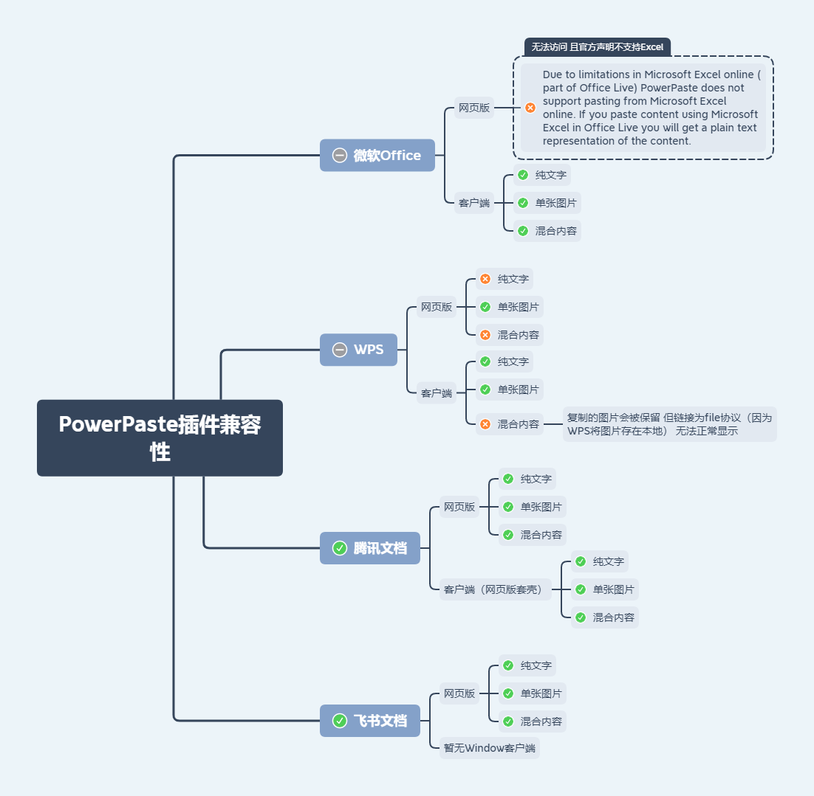

# minimce / 富文本编辑器（tinymce封装）

### Features

- √ 离线使用
- √ 本地图片/本地音频/本地视频上传 无缝集成 `imgpond` / `filepool`
- √ html转普通文本 使用场景：将前n个字符作为缩略简介 n值可配置
- √ 全局或局部引入 通用参数支持全局配置

`element-ui` 集成说明：

- `element-ui` 是以外置依赖的方式引入的 所以不必担心代码体积和版本不一致等问题
- 集成风格是非侵入式的
- 适配 `element-ui` 的 `el-form` 组件 支持 `el-form` 的全局disabled

`essential` 以上的 [TinyMCE Plan](https://www.tiny.cloud/pricing) 可用：

- √ `premium` 插件（`mediaembed` / `advcode` 暂时除外）
- √ 换肤、换图标风格

<br/>

### Installation


Dependencies：vue element-ui imgpond? filepool?

```js
import Minimce from 'minimce'

// 局部引入
components: { Minimce }

// 全局引入
Vue.use(Minimce)
```

<br/>

### Get started

```html

<Minimce v-model=""/>
```

| Attribute | Description | Configuration Mode | Type | Accepted Values | Default |
| --- | --- | --- | --- | --- | --- |
| value / v-model | 双绑 | props | string | | |
| apiKey | tinymce api key | global，props | string | https://www.tiny.cloud/auth/signup/ | |
| plan | tinymce plan（默认启用plan包含的所有插件，tinydrive、mediaembed除外） | global | string | 'core'/'essential'/'professional'/'custom' 参考https://www.tiny.cloud/pricing | 'core' |
| disabled | 是否禁用（禁用模式不可编辑，保留工具栏） | props | boolean | | false |
| readonly | 是否只读（只读模式仅展示html，相当于预览） | props | boolean | | false |
| html2text | 是否开启html转普通文本功能 | global，props | boolean | | false |
| text | value对应的普通文本（仅在html2text为true时有效） | props | string | | |
| textMaxlength | 普通文本取自前多少个字符（设置为Infinity则不设上限） | global，props | number | | 30 |
| tinymceOptions | tinymce配置 | global，props | object/function | https://www.tiny.cloud/docs/configure/ | 除setup之外均可配置 |
| Imgpond | 上传图片插件（配置后自动开启功能） | global | Vue Component | | |
| Filepool | 上传文件插件（配置后自动开启功能） | global | Vue Component | | |
| MobileLink | 插入移动端页面链接插件（配置后自动开启功能） | global | Vue Component | | |

<br/>

Imgpond

> You can use Imgpond to upload local images.

```js
import Imgpond from 'imgpond'
Vue.use(Imgpond)

import Minimce from 'minimce'
Vue.use(Minimce, {
  Imgpond
})
```

<br/>

Filepool

> You can use Filepool to upload local audio and video.

```js
import Filepool from 'filepool'
Vue.use(Filepool)

import Minimce from 'minimce'
Vue.use(Minimce, {
  Filepool
})
```

<br/>

MobileLink

> tinymce的插入链接功能只能插入普通链接 如果需要定制化需求 比如想要插入的链接是移动端某个页面的链接 可以自定义一个组件

组件通过```this.$eventBus.emit('insertTag', `<div/>`)```插入标签

```js
// 事件通信
Vue.prototype.$eventBus = new Vue({
  methods: {
    emit (event, ...args) {
      this.$emit(event, ...args)
    },
    on (event, callback) {
      this.$on(event, callback)
    },
    off (event, callback) {
      this.$off(event, callback)
    }
  }
})

import MobileLink from '@/components/MobileLink'
import Minimce from 'minimce'

Vue.use(Minimce, {
  MobileLink
})
```

<br/>

**样式**


**内置样式**

```
line-height: 1.8;

overflow: auto;

p {
  margin-block-end: 0;
  margin-block-start: 0;
}

img {
  max-width: 100%;
  height: auto !important;
  vertical-align: middle;
}

audio, video {
  width: 100%;
  background-color: #000;
}
```

> 可按需复制至富文本展示端使用

<br/>

### 屏蔽指定html元素

```js
import Minimce from 'minimce'
Vue.use(Minimce, {
  tinymceOptions: {
    invalid_elements: 'iframe,frame,audio' // 默认值：'iframe,frame'
  }
})
```

<br/>

### PowerPaste (premium插件)

- 配置

```js
import Minimce from 'minimce'
import axios from 'axios'
import { getAxiosShortcut } from 'admate'
const { POST } = getAxiosShortcut(axios)

Vue.use(Minimce, {
  apiKey: process.env.VUE_APP_API_KEY,
  plan: 'essential',
  tinymceOptions: {
    images_upload_handler (blobInfo, success, failure) {
      const blob = blobInfo.blob()
      const file = new File(
        [blob],
        blobInfo.filename(),
        { type: blob.type }
      )

      POST.upload(process.env.VUE_APP_UPLOAD_API, {
        file
      }).then(res => {
        if (typeof res.data?.data === 'string') {
          success(res.data.data)
        } else {
          failure(res.data?.message)
        }
      }).catch(err => {
        failure(String(err))
      })
    },
  }
})
```

- 兼容性
  

- When using the Windows operating system, copying and pasting content from Microsoft Word 2013 (or later) in “Protected
  View” will result in plain, unformatted text. This is due to how Protected View interacts with the clipboard.

- Due to browser limitations, PowerPaste is not able to support all image types supported by Microsoft Word and
  Microsoft Excel. When powerpaste_keep_unsupported_src is set to true, PowerPaste will store the original src of
  unsupported images in a data-image-src attribute on the pasted image element. This enables developers to add further
  image support via post-processing.

<br/>

### Notice

- element-ui老版本可能存在Imgpond的图片无法清除的问题
- tinymce有依赖window对象中的某些属性 在微前端环境中（如乾坤）对window对象做了代理 会导致报错 临时的解决方式是关闭subProject的jsSandbox（新版乾坤已解决）
