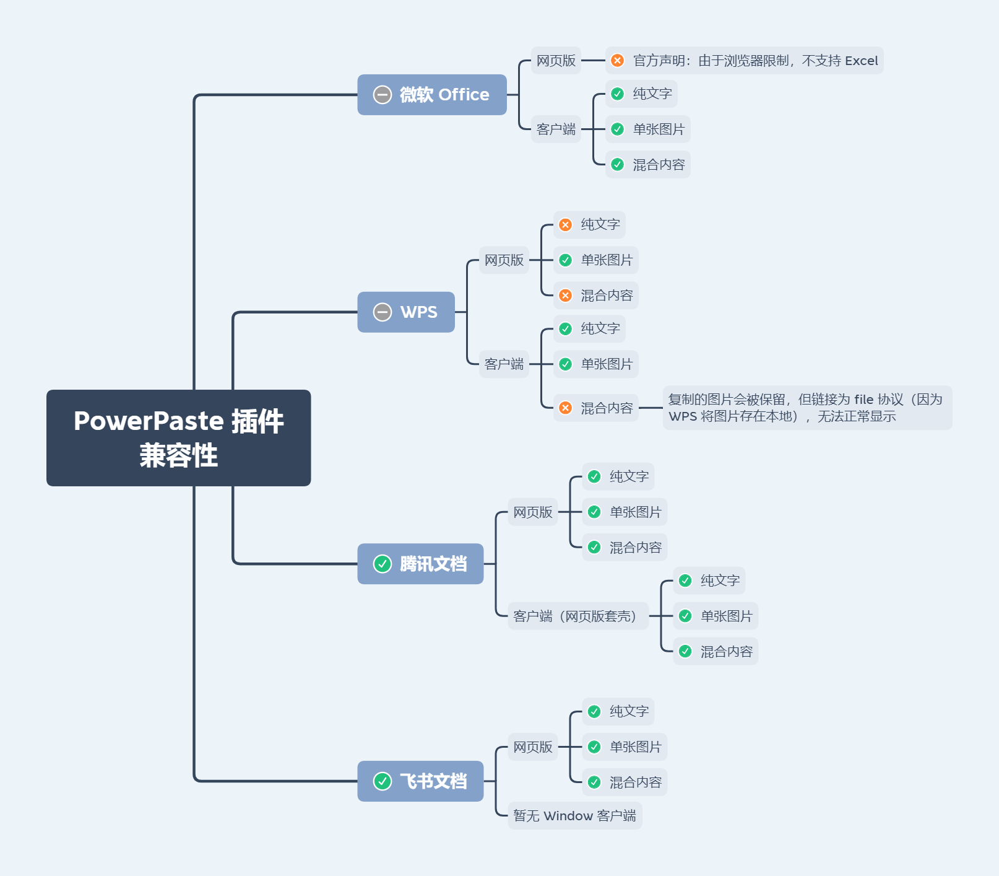

# minimce / 富文本编辑器

Offline, optionated rich-text editor powered by [tinymce](https://github.com/tinymce/tinymce).

<br>

## Features

- √ 离线使用
- √ 本地图片/音频/视频上传 无缝集成 `imgpond` / `filepool`
- √ 全局或局部引入 参数支持全局或局部配置（双向绑定参数仅支持局部配置）
- √ 默认启用 [TinyMCE Plan](https://www.tiny.cloud/pricing) 对应的全套插件
    - [premium] 由于 `mediaembed` 需要搭配后端服务 请自行配置
    - [premium] 暂不含 `advcode`
- √ 为 `essential` 以上的 `plan` 提供换肤、换图标风格工具栏选项

`element-ui` 集成说明：

- `element-ui` 是以外置依赖的方式引入的 所以不必担心代码体积和版本不一致等问题
- 集成风格是非侵入式的
- 适配 `element-ui` 的 `el-form` 组件 支持 `el-form` 的全局disabled

<br/>

## Installation


Dependencies：vue element-ui imgpond? filepool?

```ts
// 全局引入

import Minimce from 'minimce'

Vue.use(Minimce, {
  // 全局配置
})
```

```vue
<!-- 局部引入 -->

<template>
  <Minimce v-bind="config"/>
</template>

<script>
import Minimce from 'minimce'

export default {
  components: { Minimce },
  data () {
    return {
      config: {
        // 局部配置
      }
    }
  }
}
</script>
```

<br/>

## Props

| Attribute | Description | Type | Accepted Values | Default |
| --- | --- | --- | --- | --- |
| value / v-model | html格式的输入内容 | string | | |
| apiKey | tinymce api key | string | https://www.tiny.cloud/auth/signup/ | |
| plan | tinymce plan（默认启用plan包含的全套插件，mediaembed除外） | string | 'core'/'essential'/'professional'/'custom' 参考https://www.tiny.cloud/pricing | 'core' |
| disabled | 是否禁用（禁用模式不可编辑，保留工具栏） | boolean | | false |
| readonly | 是否只读（只读模式仅展示html，相当于预览） | boolean | | false |
| tinymceOptions | tinymce配置 | object / function | https://www.tiny.cloud/docs/configure/ | 除setup之外均可配置 |
| Imgpond | 上传图片插件（配置后自动开启功能） | Vue Component | | |
| Filepool | 上传文件插件（配置后自动开启功能） | Vue Component | | |
| MobileLink | 插入移动端页面链接插件（配置后自动开启功能） | Vue Component | | |

<br/>

Imgpond

> You can use Imgpond to upload local images.

```js
import Imgpond from 'imgpond'
Vue.use(Imgpond)

import Minimce from 'minimce'
Vue.use(Minimce, {
  Imgpond
})
```

<br/>

Filepool

> You can use Filepool to upload local audio and video.

```js
import Filepool from 'filepool'
Vue.use(Filepool)

import Minimce from 'minimce'
Vue.use(Minimce, {
  Filepool
})
```

<br/>

MobileLink

> tinymce的插入链接功能只能插入普通链接 如果需要定制化需求 比如想要插入的链接是移动端某个页面的链接 可以自定义一个组件

组件通过 `eventBus.$emit('insertTag', '<div/>')` 插入标签

```js
// 事件通信
const eventBus = new Vue()
export { eventBus } // 用于其它组件与Minimce进行通信

import MobileLink from '@/components/MobileLink'
import Minimce from 'minimce'

Vue.use(Minimce, {
  MobileLink,
  eventBus
})
```

<br/>

**样式**


**内置样式**

```
line-height: 1.8;

overflow: auto;

p {
  margin-block-end: 0;
  margin-block-start: 0;
}

img {
  max-width: 100%;
  height: auto !important;
  vertical-align: middle;
}

audio, video {
  width: 100%;
  background-color: #000;
}
```

> 可按需复制至富文本展示端使用

<br/>

## 屏蔽指定html元素

```js
import Minimce from 'minimce'
Vue.use(Minimce, {
  tinymceOptions: {
    invalid_elements: 'iframe,frame,audio' // 默认值：'iframe,frame'
  }
})
```

> 默认屏蔽 `iframe` 原因：小程序中不能访问没有配置的业务域名

<br/>

## PowerPaste (premium插件)

- 配置

```js
import Minimce from 'minimce'
import axios from 'axios'
import { getAxiosShortcut } from 'admate'
const { POST } = getAxiosShortcut(axios)

Vue.use(Minimce, {
  apiKey: process.env.VUE_APP_API_KEY,
  plan: 'essential',
  tinymceOptions: {
    images_upload_handler (blobInfo, success, failure) {
      const blob = blobInfo.blob()
      const file = new File(
        [blob],
        blobInfo.filename(),
        { type: blob.type }
      )

      POST.upload(process.env.VUE_APP_UPLOAD_API, {
        file
      }).then(res => {
        if (typeof res.data?.data === 'string') {
          success(res.data.data)
        } else {
          failure(res.data?.message)
        }
      }).catch(err => {
        failure(String(err))
      })
    },
  }
})
```

- 兼容性
  

- [tinymce官方] 受浏览器限制，`PowerPaste` 插件<font color="#dd0000">无法支持微软Word和Excel文档所支持的**所有**图片类型</font>
  。但将 `powerpaste_keep_unsupported_src` 参数开启时，`PowerPaste` 仍会把不支持图片的原始链接存储在 `data-image-src`
  属性中，以便开发者通过 `post-processing` 钩子做进一步处理。

- [tinymce官方] 粘贴微软Word文档（Windows系统、≥2013版本）中<font color="#dd0000">受保护视图</font>的内容，将仅得到**无格式的普通文本**，这是受保护视图与剪贴板的交互机制决定的。

- [tinymce官方] 受微软Excel网页版限制，粘贴<font color="#dd0000">微软Excel网页版</font>的内容将仅得到**无格式的普通文本**。

<br/>

## Notice

- `element-ui` 老版本可能存在 `Imgpond` 的图片无法清除的问题
- `tinymce` 有依赖window对象中的某些属性 在微前端环境中（如 `乾坤`）对window对象做了代理 会导致报错 临时的解决方式是关闭subProject的jsSandbox（新版 `乾坤` 已解决）
